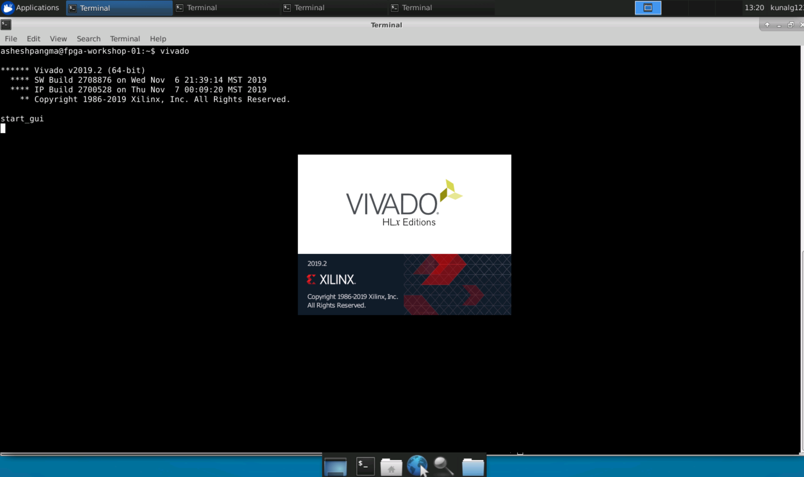
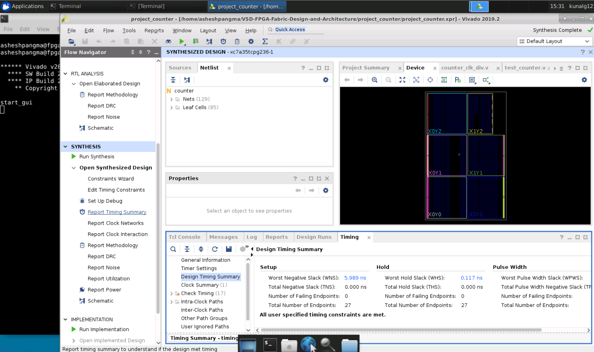
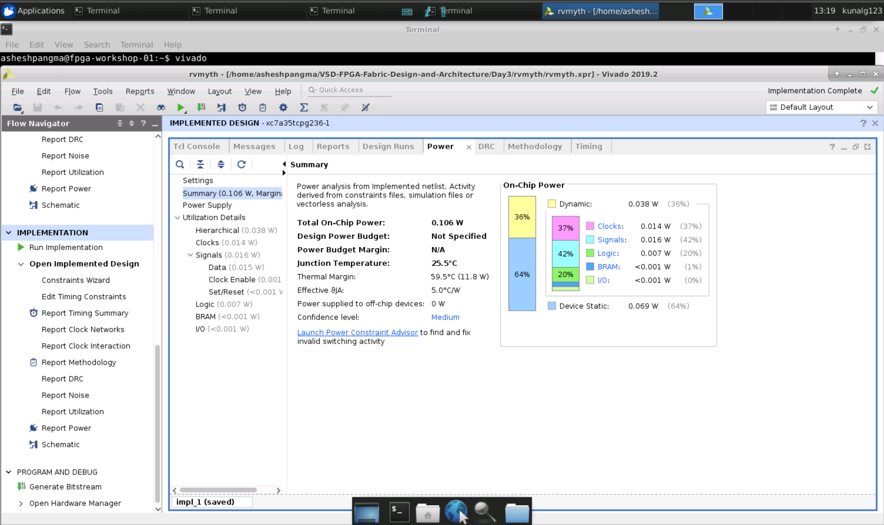
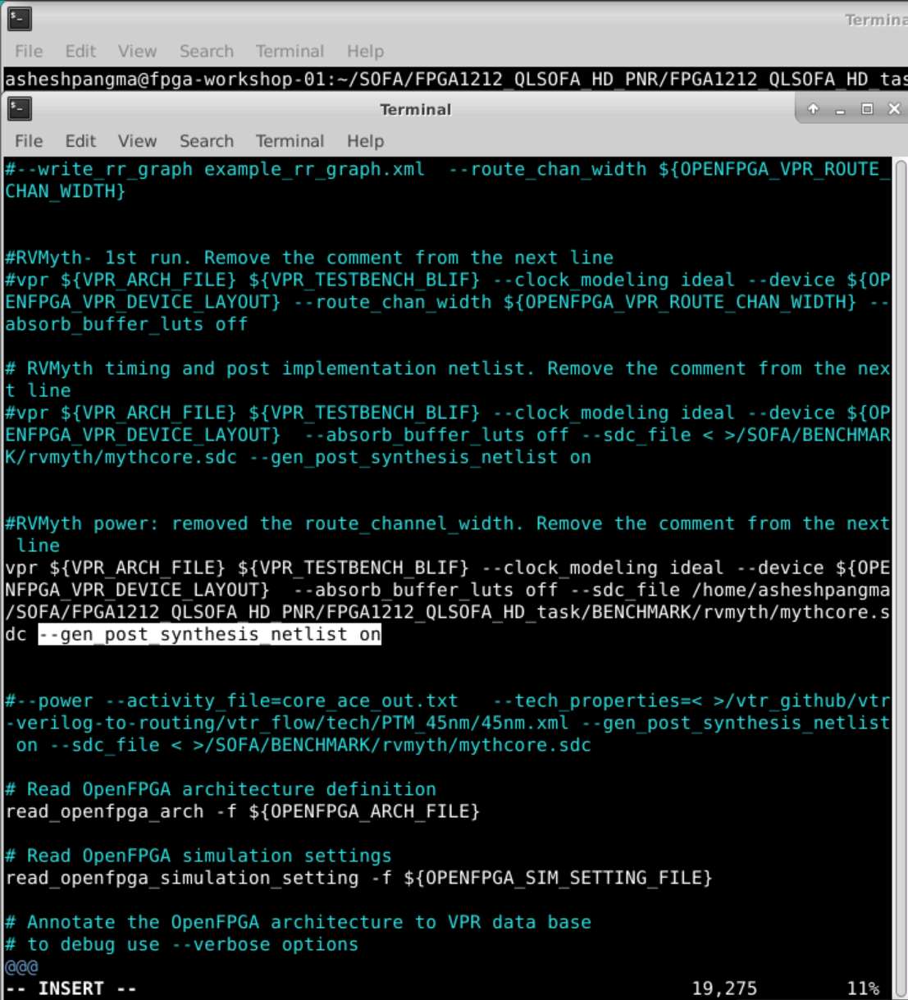
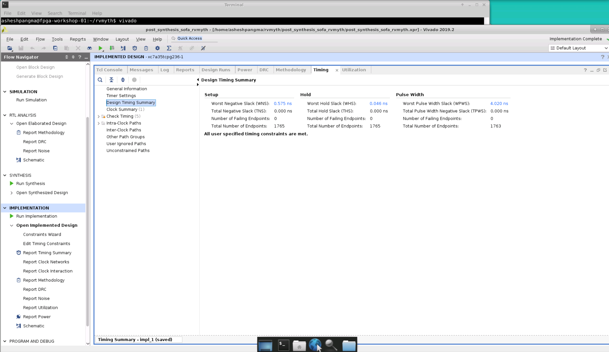
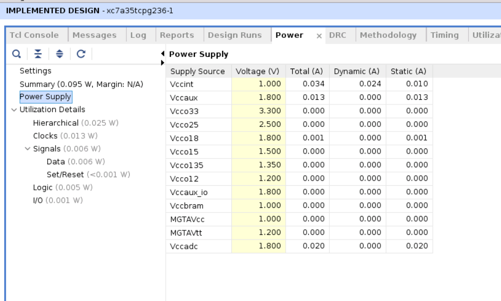

# VSD-FPGA-Fabric-Design-and-Architecture

This repository provides all the information about 5-day workshop titled FPGA-Fabric, Design and Architecture. This workshop is cloud based and covers FPGA introduction, OpenFPGA, RISC-V core programming in Vivado, Introduction to SOFA FPGA Fabric IP and RISC-V core on custom SOFA fabric. All the lab are performed on VSD online platform using open source tools.

# Table of Contents

- [Day 1 - Introduction to FPGA](#day-1---introduction-to-fpga)
  * [FPGA Architecture](#fpga-architecture)
  * [Counter in Xilinx Vivado](#counter-in-xilinx-vivado)
  * [VIO](#vio)
- [Day 2 - Introductoion to OpenFPGA, VPR and VTR](#day-2---introduction-to-openfpga-vpr-and-vtr)
  * [OpenFPGA](#openfpga)
  * [VPR](#vpr)
  * [VTR](#vtr)
- [Day - 3 RISC-V core Programming on Vivado](#day-3---risc-v-core-programming-on-vivado)
  * [RVMyth vivado rtl-to-synthesis](#rvmyth-vivado-rtl-to-synthesis)
  * [RVMyth Vivado synthesis-to-bitstream](#rvmyth-vivado-synthesis-to-bitstream)
- [Day 4 - Introduction to SOFA FPGA Fabric IP](#day-4---introduction-to-sofa-fpga-fabric-ip)
  * [SOFA counter area](#sofa-counter-area)
  * [SOFA counter timing](#sofa-counter-timing)
  * [SOFA counter post implementation netlist](#sofa-counter-post-implementation-netlist)
  * [SOFA counter power](#sofa-counter-power)
- [Day 5 - RISC-V core on custom SOFA fabric](#day-5---risc-v-core-on-custom-sofa-fabric)
  * [SOFA RVMyth run](#sofa-rvmyth-run)
  * [SOFA RVMyth timing and area](#sofa-rvmyth-timing-and-area)
  * [RVMyth post implementation netlist](#rvmyth-post-implementation-netlist)
  * [SOFA RVMyth Vivado simulation](#sofa-rvmyth-vivado-simulation)
  * [SOFA counter power](#sofa-counter-power)
- [References](#references)
- [Acknowledgement](#acknowledgement)

# Day 1 - Introduction To FPGA

FPGA stands for Field Programmable Gate Array. This means FPGA can be programmed by a designer using Hardware Description Language that is similar to ASIC design. FPGA provides a lot of advantages when compared to ASIC. FPGA can be reconfigured, however ASIC must be redesigned and sent for refabrication process that is tedious and expensive. FPGA also facilitates faster design. When compared in terms of performance ASIC has better performance while consuming less power than FPGA.

## FPGA Architecture

## Counter in Xilinx Vivado

Inverter Layout Cells |  Extraction from Inverter in Magic
:-------------------------:|:-------------------------:
 |   

## VIO

# Day 2 - Introduction to OpenFPGA, VPR and VTR

## OpenFPGA

## VPR

## VTR

# Day - 3 RISC-V core Programming on Vivado

## RVMyth vivado rtl-to-synthesis

## RVMyth Vivado synthesis-to-bitstream

# Day 4 - Introduction to SOFA FPGA Fabric IP

## SOFA counter area

## SOFA counter timing

## SOFA counter post implementation netlist

## SOFA counter power

# Day 5 - RISC-V core on custom SOFA fabric

## SOFA RVMyth run

## SOFA RVMyth timing and area

## RVMyth post implementation netlist

## SOFA RVMyth Vivado simulation

## SOFA counter power

# References

* VLSI System Design: https://www.vlsisystemdesign.com/
* RISC-V based Microprocessor: https://github.com/shivanishah269/risv-v-core
* 4-stage RISC-V Core: https://github.com/ShonTaware/RISC-V_Core_4_Stage
* SOFA: https://github.com/lnis-uofu/SOFA
* OpenFPGA: https://openfpga.readthedocs.io/en/master/
* VPR: https://docs.verilogtorouting.org/en/latest/vpr/
* VTR: https://docs.verilogtorouting.org/en/latest/

# Acknowledgement

* Kunal Ghosh, Co-founder, VSD Corp. Pvt. Ltd.
* Nanditha Rao

