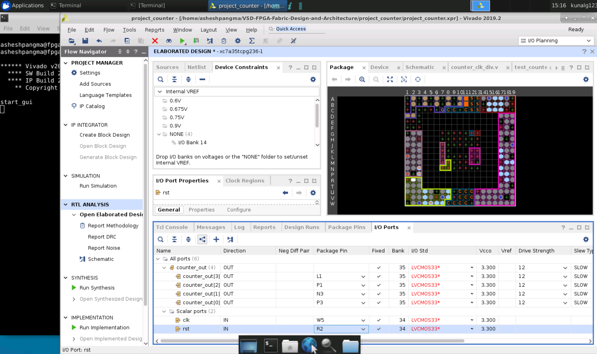
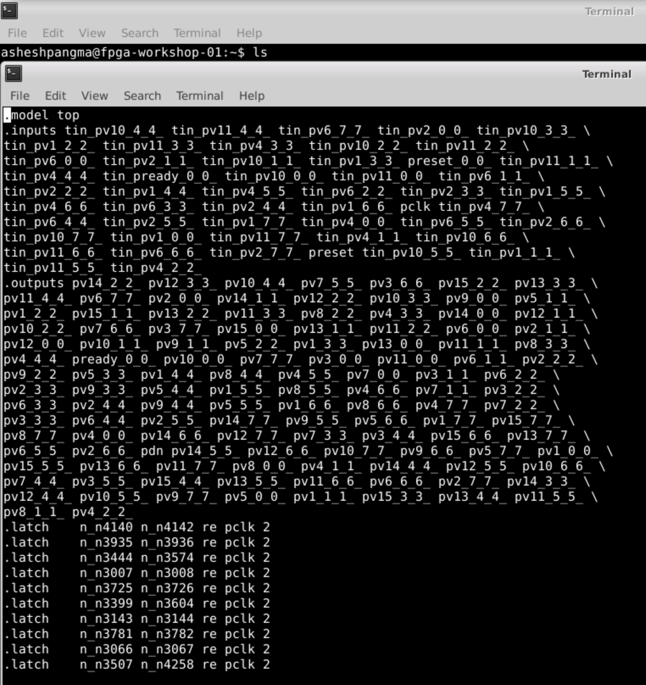
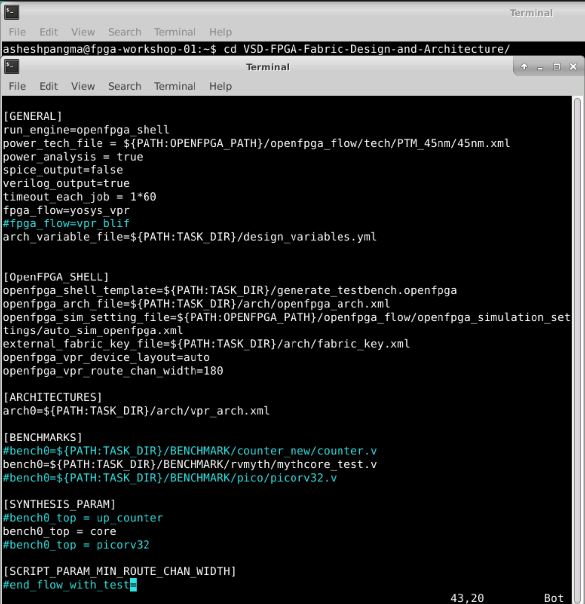
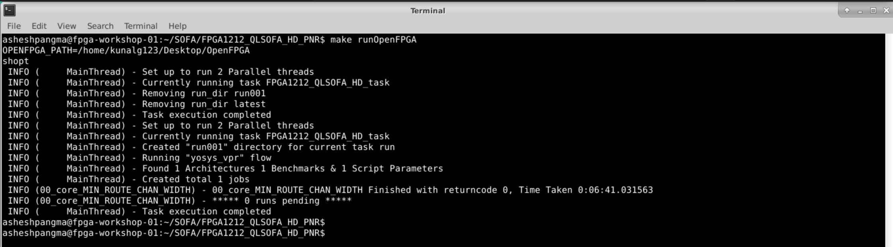

# VSD-FPGA-Fabric-Design-and-Architecture

This repository provides all the information about 5-day workshop titled FPGA-Fabric, Design and Architecture. This workshop is cloud based and covers FPGA introduction, OpenFPGA, RISC-V core programming in Vivado, Introduction to SOFA FPGA Fabric IP and RISC-V core on custom SOFA fabric. All the lab are performed on VSD online platform using open source tools.

# Table of Contents

- [Day 1 - Introduction to FPGA](#day-1---introduction-to-fpga)
  * [FPGA Architecture](#fpga-architecture)
  * [Counter in Xilinx Vivado](#counter-in-xilinx-vivado)
  * [VIO](#vio)
- [Day 2 - Introductoion to OpenFPGA, VPR and VTR](#day-2---introduction-to-openfpga-vpr-and-vtr)
  * [OpenFPGA](#openfpga)
  * [VPR](#vpr)
  * [VTR](#vtr)
- [Day - 3 RISC-V core Programming on Vivado](#day-3---risc-v-core-programming-on-vivado)
  * [RVMyth vivado rtl-to-synthesis](#rvmyth-vivado-rtl-to-synthesis)
  * [RVMyth Vivado synthesis-to-bitstream](#rvmyth-vivado-synthesis-to-bitstream)
- [Day 4 - Introduction to SOFA FPGA Fabric IP](#day-4---introduction-to-sofa-fpga-fabric-ip)
  * [SOFA counter area](#sofa-counter-area)
  * [SOFA counter timing](#sofa-counter-timing)
  * [SOFA counter post implementation netlist](#sofa-counter-post-implementation-netlist)
  * [SOFA counter power](#sofa-counter-power)
- [Day 5 - RISC-V core on custom SOFA fabric](#day-5---risc-v-core-on-custom-sofa-fabric)
  * [SOFA RVMyth run](#sofa-rvmyth-run)
  * [SOFA RVMyth timing and area](#sofa-rvmyth-timing-and-area)
  * [RVMyth post implementation netlist](#rvmyth-post-implementation-netlist)
  * [SOFA RVMyth Vivado simulation](#sofa-rvmyth-vivado-simulation)
  * [SOFA counter power](#sofa-counter-power)
- [References](#references)
- [Acknowledgement](#acknowledgement)

# Day 1 - Introduction To FPGA

FPGA stands for Field Programmable Gate Array. This means FPGA can be programmed by a designer using Hardware Description Language that is similar to ASIC design. FPGA provides a lot of advantages when compared to ASIC. FPGA can be reconfigured, however ASIC must be redesigned and sent for refabrication process that is tedious and expensive. FPGA also facilitates faster design than ASIC. When compared in terms of performance ASIC has better performance while consuming less power than FPGA.

## FPGA Architecture

FPGAjprimarily consists of CLBs (Configurable Logic Blocks), LUTs (Look up Tables), Programmable interconnects, I/O cells, Memory/Block RAM, Flip flops. CLB is where the combinational or sequential logics is implemented. It is comprise of LUTs, Carry and control logic and Flip-flops and/or latches.

In this workshop, We also learned about Basys3 FPGA board. we were taught to program Basys3 Artix-7 FPGA board and observe the output of our design. 


## Counter in Xilinx Vivado

The verilog code for 4-bit counter module is shown below. We use this counter for exploring the Vivado tool and OpenFPGA. 
```
`timescale 1ns / 1ps
// Description: 4 bit counter with source clock (100MHz) division.

module counter_clk_div(clk,rst,counter_out);
input clk,rst;
reg div_clk;
reg [25:0] delay_count;
output reg [3:0] counter_out;

//////////clock division block////////////////////
always @(posedge clk)
begin
    if(rst)
    begin
        delay_count<=26'd0;
        div_clk <= 1'b0;    //initialise div_clk
    end
    else
//uncomment this line while running just the div clock counter for simulation purpose
        if(delay_count==26'd212)
//comment this line while running just the div clock counter for simulation purpose
//if(delay_count==26'd32112212)
        begin
            delay_count<=26'd0; //reset upon reaching the max value
            div_clk <= ~div_clk;  //generating a slow clock
        end
        else
        begin
            delay_count<=delay_count+1;
        end
    end
end

/////////////4 bit counter block///////////////////
always @(posedge div_clk)
begin
    if(rst)
    begin
        counter_out<=4'b0000;
    end
    else
    begin
        counter_out<= counter_out+1;
    end
end

endmodule 
```


We use the command `Vivado` to invoke the Vivado tool. The below screenshot shows Vivado tool being invoked. We then created a new project named project_counter in our desired location.
Vivado starting up | Creating new project
:-------------------------:|:-------------------------:
 |  


Board selection |  Adding design sources
:-------------------------:|:-------------------------:
 | 


Design and Simulation sources added |  Behavioral simulation of counter
:-------------------------:|:-------------------------:
 | 


Elaborated design | Assigning I/O ports
:-------------------------:|:-------------------------:
 | 


We then run synthesis. The below screenshot shows the output of synthesized design. Since no constraint were provided the timing report cannot be obtained.

No constraints | Synthesis result
:-------------------------:|:-------------------------:
 | 

We provided clock constraint of frequency 100MHz as shown by the screenshot below.


Then, we ran synthesis again. After the successful synthesis, I opened the timing report. We can see from the following snippet that the setup and hold time are both positive. This means that there is no setup and hold violation.


After synthesis, we ran implementation. The following snippet shows the result of implementation with slight change in setup and hold time.


We can view the utilization report, Timing report and power report after implementation. The below screenshot shows the utilization report.


The below screenshot shows the timing report.


Timing report | Source Clock Path
:-------------------------:|:-------------------------:
 | 

Data Path | Destination Clock Path
:-------------------------:|:-------------------------:
 | 

The below screenshot shows power report.


After implemantation, the last step is to generate bit stream that can be done by pressing `Generate Bitstream` option in the window. After bit stream generation is completed, we get `write_bitstream Complete` at the upper right corner of the window as shown in the below snippet. 
This generated bit stream is used to program our FPGA board.


After successful bitstream generation, we can open hardware manager from where we can select our target hardware that is to be programmed. Since, I had no physical FPGA board and no board connected to cloud, I could not actually program a FPGA. However, I learned the way to program actual FPGA board and will implement it in future.


## VIO Counter

VIO stands for Virtual Input/Output. It is used to monitor and drive signals in FPGA in real time. We use ILA (Integrated Logic Analyzer) to observe output of the counter. 
We first updated our counter verilog file to include only clock signal as shown below.
```
module counter_clk_div(clk);
input clk;
wire rst;
reg div_clk;
reg [25:0] delay_count;
reg [3:0] counter_out;
```
Then, we generated VIO IP. For this, we go to `IP catalogue` and search `vio`. Then, we opened VIO(Virtual Input/Output) and supplied the requirements as needed that is shown by the following screenshots.


General option | PROBE_IN ports
:-------------------------:|:-------------------------:
 | 

PROBE_OUT ports | vio instance
:-------------------------:|:-------------------------:
 | 

The code snippet for VIO is added to our counter verilog file as shown by the following screenshot.


Then the vio code snippet is updated as below.

```
vio_0 vioname (
  .clk(clk),                  // input wire clk
  .probe_in0(div_clk),        // input wire [0 : 0] probe_in0
  .probe_in1(counter_out),    // input wire [3 : 0] probe_in1
  .probe_out0(rst)            // output wire [0 : 0] probe_out0
);
```
Then we run the simulation, synthesis and implementation.


# Day 2 - Introduction to OpenFPGA, VPR and VTR

## OpenFPGA

OpenFPGA is the first open-source FPGA IP generator and can be used to quickly generate fabric for custom FPGA specific to our design. The main advantages of OpenFPGA are as follows:
* Automated techniques
* Reduces FPGA development cycle to few days
* Open source design tools

Custom FPGA are need for high performance result. However, we require a custom FPGA architecture and producing and prototyping a custom FPGA is costly and time-consuming. OpenFPGA provides a full set of EDA support customized FPGAs, including Verilog-to-bitstream generation and self-testing verification. OpenFPGA uses agile prototyping approaches and constantly updates tools for chip designers and researchers. Some other advantages of OpenFPGA are as follows:
* Customise your own FPGA fabric using set of templates (>20 FPGA architectures-in xml file)
* Generates Verilog netlists describing an FPGA fabric based on XML based description file: VPR's (Versatile Place and Route) architecture description language.
* Allows you to write your own FPGA fabric (for a specific application) using OpenFPGA's architecture description language
* Automatically generates verilog testbenches to validate the correctness of FPGA fabric
* Bitstream generation support based on the XML-based description file


## VPR


EArch.xml | EArch.xml
:-------------------------:|:-------------------------:
 | 


tseng.blif | tseng.blif
:-------------------------:|:-------------------------:
 | 

The following command is used to run VPR.


A VPR window is obtained as shown below. 
VPR window | Corresponding Terminal output
:-------------------------:|:-------------------------:
 | 


## VTR


# Day - 3 RISC-V core Programming on Vivado


## RVMyth vivado rtl-to-synthesis


## RVMyth Vivado synthesis-to-bitstream


# Day 4 - Introduction to SOFA FPGA Fabric IP

## SOFA counter area


## SOFA counter timing


## SOFA counter post implementation netlist

## SOFA counter power


# Day 5 - RISC-V core on custom SOFA fabric


## SOFA RVMyth run







## SOFA RVMyth timing and area


## RVMyth post implementation netlist


## SOFA RVMyth Vivado simulation

## SOFA counter power

# References

* VLSI System Design: https://www.vlsisystemdesign.com/
* RISC-V based Microprocessor: https://github.com/shivanishah269/risv-v-core
* 4-stage RISC-V Core: https://github.com/ShonTaware/RISC-V_Core_4_Stage
* SOFA: https://github.com/lnis-uofu/SOFA
* OpenFPGA: https://openfpga.readthedocs.io/en/master/
* VPR: https://docs.verilogtorouting.org/en/latest/vpr/
* VTR: https://docs.verilogtorouting.org/en/latest/

# Acknowledgement

* Kunal Ghosh, Co-founder, VSD Corp. Pvt. Ltd.
* Nanditha Rao


